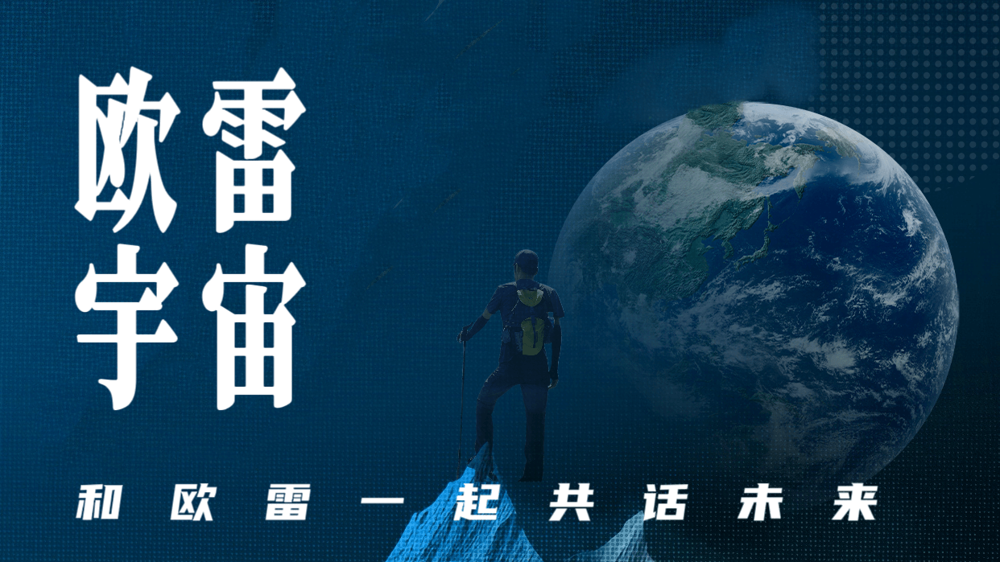
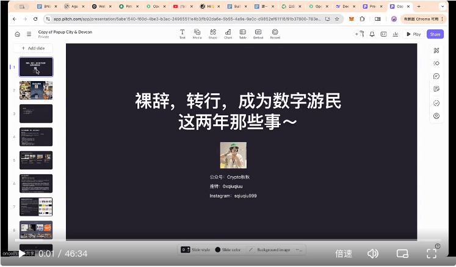

本次分享由「[欧雷宇宙](https://c.ourai.ws/)」社区与[冴羽](https://yayujs.com)的「[低调务实优秀中国好青年](https://www.yuque.com/yayu/nice-people)」社群联合举办。

## 欧雷宇宙，一场关于「把自己作为平台」的探索实践

讲讲「欧雷宇宙」社区的来历，以及基于它可以做哪些事。

<figure>
  
  <figcaption>👆🏼 点击观看回放 👆🏼</figcaption>
</figure>

- 分享人：[欧雷](https://linxoid.com/ourai)，反混沌工程师
- 分享时间：2025-02-22 20:00:00（[好青年社群第 26 期茶话会](https://www.yuque.com/yayu/nice-people/share26)）

## 裸辞，转行，All in Web3 成为数字游民这两年 & 那些事

讲讲成为 Web3 数字游民的心路历程。

<figure>
  
  <figcaption>👆🏼 点击观看回放 👆🏼</figcaption>
</figure>

- 分享人：[秋秋](https://x.com/0xqiuqiuu)，Web3 数字游民
- 分享时间：2025-03-16 20:00:00（[好青年社群第 27 期茶话会](https://www.yuque.com/yayu/nice-people/share27)）
